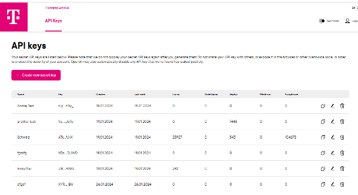

 # Introduction

Welcome to AI Foundation Services - your gateway to private, secure, and scalable model inference. Hosted in Germany and the EU, our platform ensures your data remains in safe hands, adhering strictly to GDPR guidelines. With our T-Systems LLM API Key, you unlock access to a diverse range of open-source and proprietary LLMs, all formatted with an OpenAI-compatible API. Get started effortlessly with zero-effort migration and integration of your existing AI applications.
 
### Key Features
 
- **Ease of use:** We provide simple APIs for querying and fine-tuning LLMs, tailored to your specific needs.
- **Fully managed:** Enjoy features like auto-scaling and pay-as-you-go, keeping your models operational without manual intervention.
- **German/EU-Hosted Security:** Your data is in safe hands with our GDPR-compliant hosting in Germany and the EU.
- **Diverse LLM Options:** Access a wide range of open-source and proprietary LLMs with our T-Systems LLM API Key.
 
### Get Started
 
1. **Request a Trial API key:** [Fill out our form](https://docs.google.com/forms/d/e/1FAIpQLSdBDhCijYUIUeyJVTLzCy0rm55XgD2nG5supwtGRHXVfaX-fw/viewform) to receive your API key.
2. **Run your first query:** Once you have your API key, [dive into querying LLMs](./03_Quickstart.md) to unlock their potential.

## Our Product
### Magenta SmartChat {#magenta-smartchat}

Build dynamic conversational interfaces for customer service, internal knowledge bases, and more with our intelligent chat application powered by LLM endpoints and RAG API.

[Magenta SmartChat](https://smartchat.llmhub.t-systems.net/)

### LLM Playground {#llm-playground}

Experiment with various LLMs, prompt templates, and documents by providing your API key.

[LLM Playground](https://playground.llmhub.t-systems.net/)

### Create-TSI {#create-tsi}

Generate AI applications with low code using our generative AI RAG toolkit and LlamaIndex.

[Create TSI on GitHub](https://github.com/telekom/create-tsi)

<video width="600" controls>
  <source src="/img/create-tsi.mp4" type="video/mp4"> </source>
</video>
LLM model serving, allowing you to effortlessly query open-source LLM models like Llama3, GPT-4, and Mistral AI models through a simple, OpenAI-compatible API.

### API Key Portal {#api-key-portal}

Manage your LLM API keys and monitor token usage efficiently.

[LLM API Key Portal](https://apikey.llmhub.t-systems.net/)

