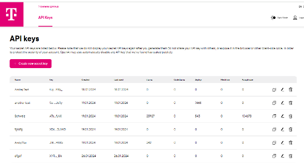

# Overview

## Available LLMs on AI Foundation Service

| Models | Provider | Availability |
| --------------- | --------------- | --------------- |
| Mixtral-8x7b Instruct v.01   | Mistral AI  | Yes   |
| Llama-3-70b   | Meta    | Yes   |
| GPT-4-Turbo-2024-05-09  | OpenAI (via Azure)    | Yes   |
| GPT-3.5-Turbo-0314  | OpenAI (via Azure)     | On request   |
| Claude 3 Sonnet  | Anthropic    | On request   |
| Mistral-Large-2402  | Mistral AI   | On request   |
| Mistral-7b  | Mistral AI   | On request   |

## Smartchat

SmartChat - an intelligent chat application powered by our LLM endpoints and RAG API. SmartChat allows you to build dynamic conversational interfaces for customer service, internal knowledge bases, and more.

## LLM Playground

Playground: Experiment with different LLMs, Prompt Templates and Documents by providing your API key. 

## Create-tsi

<video width="600" controls>
  <source src="/img/create-tsi.mp4" type="video/mp4"> </source>
</video>
LLM model serving, allowing you to effortlessly query open-source LLM models like Llama3, GPT-4, and Mistral AI models through a simple, OpenAI-compatible API.

## API Portal

API Portal - Allows you to manage your LLM API Keys and monitor your token usage
